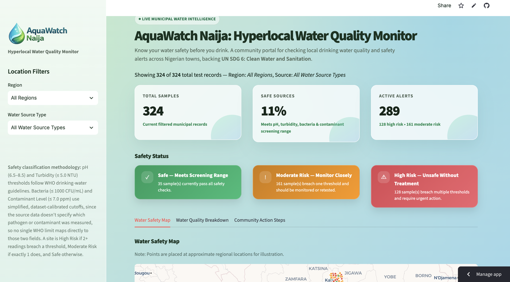
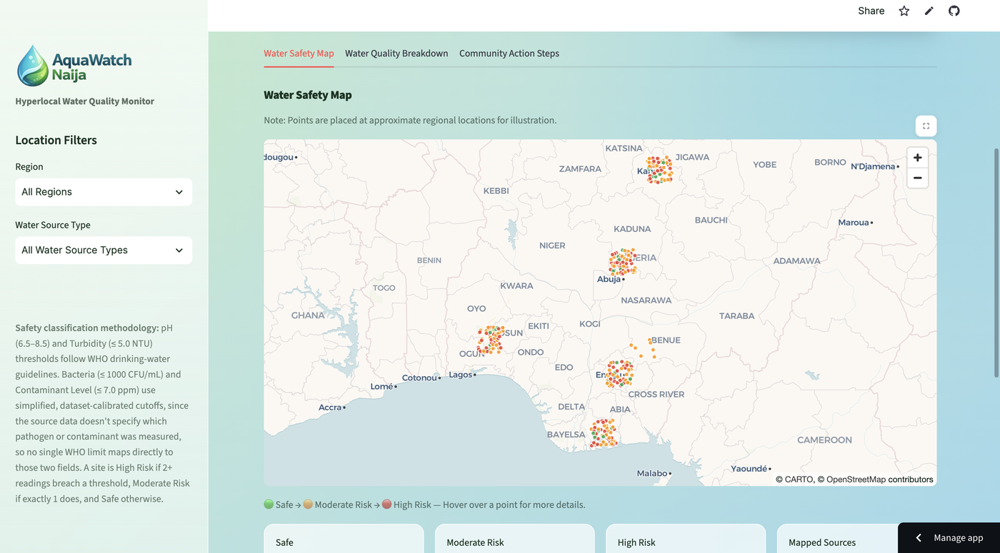
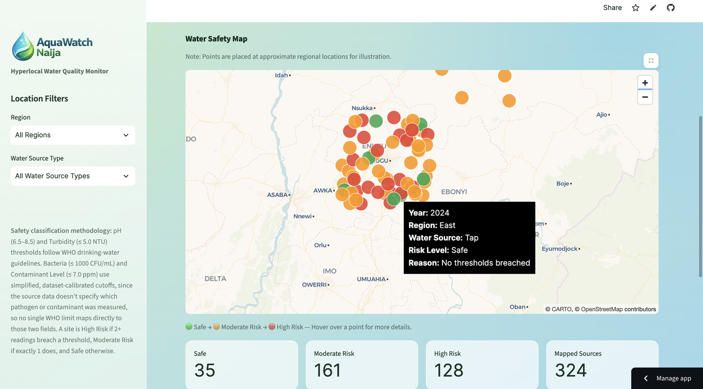
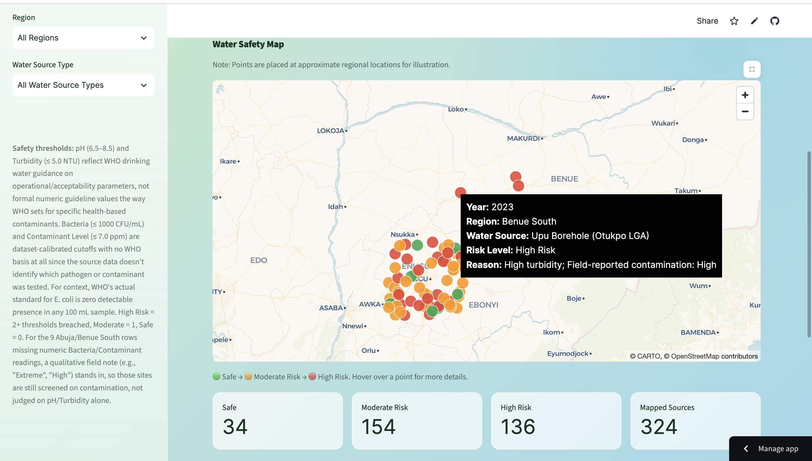
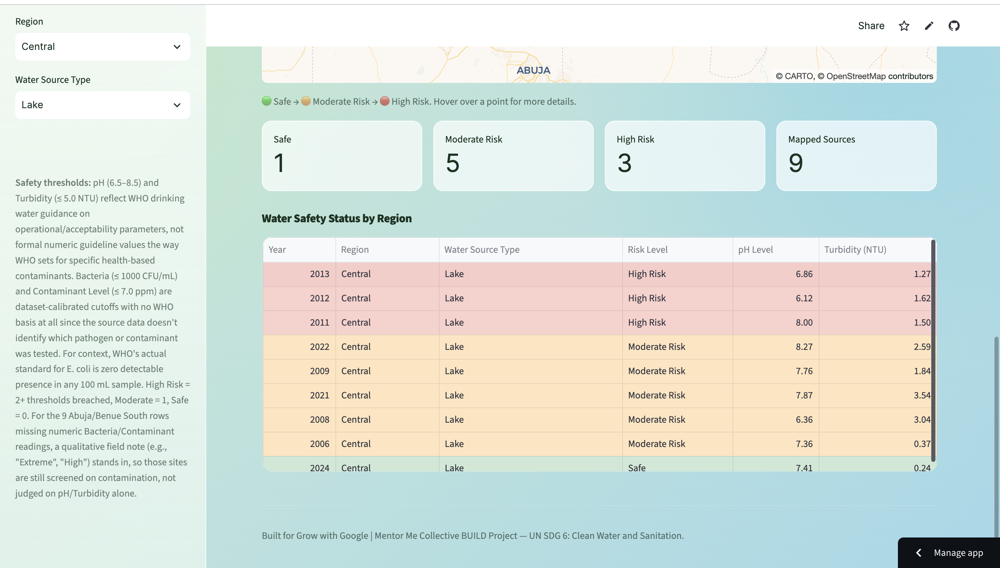
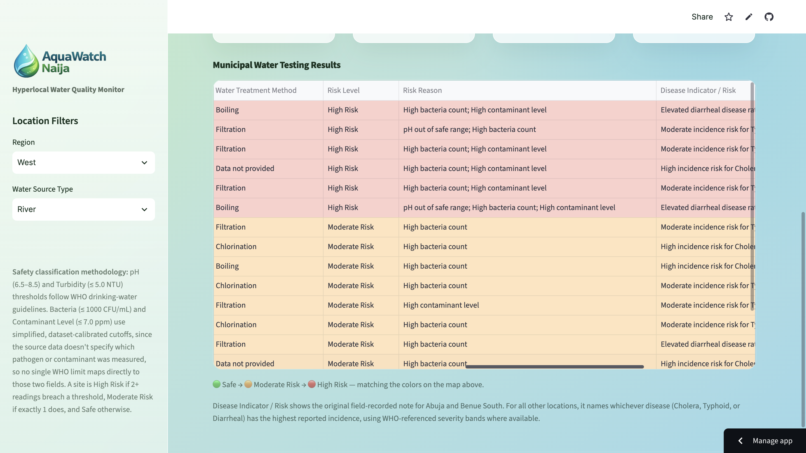
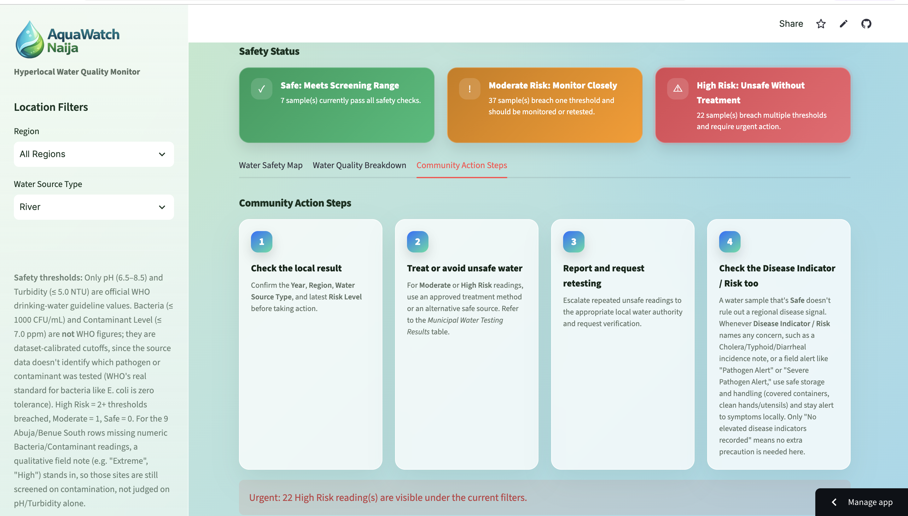

# 💧 AquaWatch Naija: Hyperlocal Water Quality Monitor Portal


[**Live App**](https://team-quantum-engineers-water-monitor.streamlit.app/) · [**Video Walkthrough**](https://youtu.be/vCDKWgl18uc?si=7mRyWpNsg9fljHA-) · [**Setup Instructions**](#setup-instructions)

**Team:** Quantum Engineers

**Team Members:** Alaisha Key, Douglas Phiri, Manahil Bashir, Nkechika Akpe, Sarah Davis

**UN SDG Goal:** Goal 6, Clean Water and Sanitation

**Assigned Problem Statement:** Community members lack a central, accessible public dashboard to view municipal water testing results and safety warnings.

---

## 📑 Table of Contents

1. [What AquaWatch Naija Does (and Why It Matters)](#what-it-does)
2. [Key Features](#key-features)
3. [Screenshots](#screenshots)
4. [Alignment with SDG 6](#sdg-alignment)
5. [Tech Stack](#tech-stack)
6. [Grow with Google Resources Used](#grow-with-google-resources)
7. [Research & Data](#research-data)
8. [Live App & Setup Instructions](#setup-instructions)
9. [Video Walkthrough](#video-walkthrough)
10. [Implementation Plan](#implementation-plan)
11. [Future Ideas](#future-ideas)
12. [License](#license)

---

<a name="what-it-does"></a>
## 🎯 What AquaWatch Naija Does (and Why It Matters)

* **Problem Statement:** Community members lack a central, accessible public dashboard to view municipal water testing results and safety warnings.
* **Solution Summary:** AquaWatch Naija is an interactive web application that transforms water quality data into clear, actionable insights. The project connects complex public health data with everyday community awareness, empowering residents to monitor local safety levels and track historical sanitation metrics.
* **Where This Data Comes From:** No single public dashboard currently exists for local water testing in Nigeria, which is central to the challenge this project works to solve. AquaWatch Naija fills that gap by combining a major public water dataset with two peer-reviewed regional studies (see [Research & Data](#research-data)) into a unified format. Covering historical data from 2000-2024, it demonstrates how a municipal testing dashboard could function using the best available public and academic sources.

*"Naija" is a common, everyday nickname for Nigeria, used widely by Nigerians themselves. The name reflects that this dashboard is built for and by the communities it serves.*

---

<a name="key-features"></a>
## ✨ Key Features

| Feature | Description |
|---|---|
| **Interactive Dashboard** | Visualizes water testing results in an accessible, non-technical format with sidebar filters by Region and Water Source Type. |
| **Color-Coded Safety Map** | An interactive map plots every test site and color-codes it Green (Safe), Orange (Moderate Risk), or Red (High Risk); hovering a point shows the Year, Region, Water Source, Risk Level, and Reason. |
| **Year-Tagged Records** | The Kaggle dataset and regional case studies include water testing results from 2000-2024. Every test result is tagged by year, and the year is surfaced throughout the dashboard. The year is indicated in the first column in both data tables, in the map's hover tooltip, and in the Community Action Steps guidance, so users always know how current a reading is. |
| **Contamination Threshold Alerts** | Highlights when key safety indicators (pH, turbidity, bacteria count, contaminant level) cross public health thresholds, with dedicated Safe / Moderate Risk / High Risk banners. |
| **Disease Indicator / Risk Column** | Surfaces the original field-recorded public health notes where available, and otherwise names whichever disease (Cholera, Typhoid, or Diarrheal) has the highest reported incidence (per 100,000 people) for that record. |
| **Data Standardization Pipeline** | Cleans and aggregates data from public and academic sources, standardizing them into one consistent schema. |

---

<a name="screenshots"></a>
## 📸 Screenshots

<table>
<tr>
<td width="50%">

**Dashboard Overview:**
Summary metrics (Total Samples, Safe Sources, Active Alerts) and the Safe / Moderate Risk / High Risk status banners, based on the filtered dataset.



</td>
<td width="50%">

**Water Safety Map:**
Every test site is plotted and color-coded by risk level across Nigeria.



</td>
</tr>
<tr>
<td width="50%">

**Map Tooltip (Safe Reading):**
Hovering a point on the Water Safety Map shows the Year, Region, Water Source, Risk Level, and Reason.



</td>
<td width="50%">

**Map Tooltip (High Risk Reading):**
The same tooltip on a High Risk point, showing what caused the High Risk flag.



</td>
</tr>
<tr>
<td width="50%">

**Water Safety Status by Region:**
Shows risk counts filterable by region and water source, plus a results table with Year, Region, Water Source Type, Risk Level, pH Level, and Turbidity (NTU). The table shown here is filtered to the Central region and Lake source.



</td>
<td width="50%">

**Municipal Water Testing Results:**
Full results table, scrolled right to reveal the Water Treatment Method, Risk Level, Risk Reason, and Disease Indicator / Risk columns. The table scrolls both horizontally and vertically in the live app. This screenshot is cropped mid-column to show the horizontal scrollbar.



</td>
</tr>
</table>

**Community Action Steps:**
Guided next steps for residents are based on the currently filtered Risk Level.



---

<a name="sdg-alignment"></a>
## 🌍 Alignment with SDG 6

AquaWatch Naija directly supports **UN SDG 6: Clean Water and Sanitation** by:

* Increasing **public access to information** on local water safety. This is a core barrier to SDG 6 progress in underserved communities.
* Enabling **community accountability** by giving residents visibility into water testing results rather than relying on delayed or inaccessible official reports.
* Laying groundwork for **early-warning capability**, which supports the water-quality monitoring and management aims underlying SDG 6's broader targets.

---

<a name="tech-stack"></a>
## 🛠️ Tech Stack

* **Language:** Python
* **Framework:** Streamlit (interactive dashboard/web app)
* **Mapping:** pydeck (interactive, color-coded map of test sites)
* **Styling:** Custom CSS, embedded directly in `app.py`, for the dashboard's glassmorphism-style visual design
* **Data Preparation:** Google Sheets, used to extract and merge the case-study data into the Kaggle dataset's format
* **Data Processing:** Pandas- and NumPy-based pipeline for cleaning, aggregation, and standardization
* **Deployment:** Streamlit Community Cloud
* **Data Sources:** Kaggle dataset plus two academic case studies (see [Research & Data](#research-data) for full details)

---

<a name="grow-with-google-resources"></a>
## 🎓 Grow with Google Resources Used

The team collectively drew on the following Grow with Google Career Certificates to build, structure, and execute this project.

* Google Data Analytics Professional Certificate
* Google Advanced Data Analytics Professional Certificate
* Google IT Automation with Python Professional Certificate
* Google Cybersecurity Professional Certificate
* Google Digital Marketing & E-commerce Professional Certificate

**Applied Skills:**

* **Data Analytics & Advanced Data Analytics:** Shaped the risk classification logic, the color-coded map, the summary metrics, and guided how the three merged data sources were structured for exploratory analysis.
* **IT Automation with Python:** Powered the data cleaning, standardization, and aggregation pipeline that merges the Kaggle dataset with the two case studies into one schema.
* **Cybersecurity:** Informed how the team thought about protecting future user data as the project grows; this shows up directly in the [Future Ideas](#future-ideas) section's plans for role-based access control and encryption once user accounts are introduced.
* **Digital Marketing & E-commerce:** Translated complex dataset outputs into accessible messaging, user-centric visualizations, plain-language risk framing, and practical Community Action Steps that drive resident engagement.

---

<a name="research-data"></a>
## 📊 Research & Data

**Data Sources:**

* Adejuwon, E. O., Ogwueleka, T. C., Ogungbemi, E. O., Prabhu, R., Rendon-Nava, A., & Yates, K. (2025). [Assessment of surface water quality using chemometric tools: A case study of Jabi Lake, Abuja, Nigeria](https://doi.org/10.1007/s40996-024-01712-2). *Iranian Journal of Science and Technology, Transactions of Civil Engineering*, *49*, 829-852.
* Edegbene, A. O., Yandev, D., Omotehinwa, T. O., Zakaria, H., & Andy, B. O. (2025). [Water quality assessment in Benue South, Nigeria: An investigation of physico-chemical and microbial characteristics](https://doi.org/10.1080/23570008.2025.2483013). *Water Science*, *39*(1), 279-290.
* World Health Organization. (2022). [Guidelines for drinking-water quality: Fourth edition incorporating the first and second addenda](https://www.who.int/publications/i/item/9789240045064).
* Yadav, K. (2024). [Water pollution & disease](https://www.kaggle.com/datasets/khushikyad001/water-pollution-and-disease) [Dataset]. Kaggle.

### Methodology

This project combines a national dataset with two peer-reviewed regional case studies to build a hyperlocal, Nigeria-specific water quality picture. AquaWatch Naija is the centralized municipal dashboard described in the problem statement.

* The Kaggle dataset (3,000 records across multiple countries) was filtered down to Nigeria-only records, producing an initial Nigeria dataset covering the regions South, Central, East, North, and West.
* Water quality measurements from the case studies were extracted and standardized into a matching format:
  * The Jabi Lake study contributed the **Abuja (FCT)** data.
  * The Benue South study contributed data for the **Benue South Senatorial District**, drawing on water sources across three Local Government Areas (LGAs) within Benue State, Nigeria: **Otukpo, Ohimini, and Apa**.

  > **Note:** Benue South is not the same as the broad "South" region from the Kaggle dataset, which spans multiple, unrelated parts of the country. "South" and "Benue South" are two distinct regions from two different sources and are kept separate throughout the dataset and the dashboard.

The Nigeria-filtered Kaggle dataset and the relevant case study data were merged in Google Sheets into a single, finalized dataset (`nigeria_combined_water_data.csv`), which powers the dashboard.

Data cleaning, metric standardization, and exploratory data analysis were used throughout to isolate key contamination thresholds and safety indicators for public consumption.

### How Risk Is Calculated

pH (6.5–8.5) and Turbidity (5.0 NTU or below) reflect World Health Organization (WHO) drinking water guidance on operational and acceptability parameters, not formal numeric guideline values the way WHO sets for specific health-based contaminants. Bacteria (1000 CFU/mL or below) and Contaminant Level (7.0 ppm or below) are dataset-calibrated cutoffs with no WHO basis at all since the source data doesn't identify which pathogen or contaminant was tested. For context, WHO's actual standard for E. coli is zero detectable presence in any 100 mL sample. A sample is High Risk at 2 or more threshold breaches, Moderate Risk at 1, and Safe at 0. For the 9 Abuja/Benue South rows that lack numeric Bacteria/Contaminant readings, a qualitative field note (e.g., "Extreme," "High") stands in for those two checks, so those sites are still screened on contamination rather than judged on pH/Turbidity alone.

Risk Level and Disease Indicator / Risk are separate signals. Risk Level checks whether a water sample passes its own safety checks. Disease Indicator / Risk checks whether the region is seeing higher rates of Cholera, Typhoid, or Diarrheal disease (the same 9 Abuja/Benue South sites, which have no regional disease case data, show the original field contamination note here too). Regional illness can stem from causes beyond a single water sample, such as storage, distribution, sanitation, or a past outbreak. Because of that, a sample can read Safe even in a High disease indicator region. That's expected, not an error.

---

<a name="setup-instructions"></a>
## 🚀 Live App & Setup Instructions

### Option A: Use the Live App (No Setup Required)

👉 **[team-quantum-engineers-water-monitor.streamlit.app](https://team-quantum-engineers-water-monitor.streamlit.app/)**

This is the fastest way to explore the dashboard. Filter by Region and Water Source Type, view the Water Safety Map, and browse the full testing results table, all in your browser.

### Option B: Run It Locally

Running locally is useful if you want to read or modify the code rather than just view the dashboard.

**Requirements:** Python 3.11 or higher and Git. If you're not sure whether you have these, follow the instructions for your operating system below. They include how to check and install what you need.

---

#### On Mac

1. **Check for Git:**
   ```
   git --version
   ```
   If prompted to install "developer tools," click Install and wait for it to finish.

2. **Check your Python version:**
   ```
   python3 --version
   ```
   If it's below 3.11, install a newer version:
   ```
   # Install Homebrew (skip if you already have it: check with `brew --version`)
   /bin/bash -c "$(curl -fsSL https://raw.githubusercontent.com/Homebrew/install/HEAD/install.sh)"

   # Install Python 3.12
   brew install python@3.12
   ```

3. **Clone the repository and check out our branch:**
   ```
   git clone https://github.com/sarelizd/grow-with-google-showcase.git
   cd grow-with-google-showcase
   git checkout team-quantum-engineers
   cd 2026-cohort/team-quantum-engineers-water-monitor/src
   ```

4. **Create and activate a virtual environment:**
   ```
   python3 -m venv venv
   source venv/bin/activate
   ```
   Your terminal prompt should now start with `(venv)`.

5. **Install dependencies (only needed once):**
   ```
   pip install -r requirements.txt
   ```

6. **Run the app:**
   ```
   streamlit run app.py
   ```
   The very first time you run Streamlit on a new machine, it may ask for an email address for onboarding updates. This is optional; press Enter to skip it.

7. **To stop:** press `Ctrl+C`, then optionally run `deactivate`.

**Next time**, you only need:
```
cd path/to/grow-with-google-showcase/2026-cohort/team-quantum-engineers-water-monitor/src
source venv/bin/activate
streamlit run app.py
```

---

#### On Windows

1. **Open PowerShell** (search "PowerShell" in the Start menu).

2. **Check for Git:**
   ```
   git --version
   ```
   If not found, install it from [git-scm.com/download/win](https://git-scm.com/download/win) using the default options, then restart PowerShell.

3. **Check your Python version:**
   ```
   python --version
   ```
   If it's below 3.11 or not found, install Python from [python.org/downloads](https://python.org/downloads). **On the installer's first screen, check "Add python.exe to PATH"** before clicking Install. Restart PowerShell afterward.

4. **Clone the repository and check out our branch:**
   ```
   git clone https://github.com/sarelizd/grow-with-google-showcase.git
   cd grow-with-google-showcase
   git checkout team-quantum-engineers
   cd 2026-cohort/team-quantum-engineers-water-monitor/src
   ```

5. **Create and activate a virtual environment:**
   ```
   python -m venv venv
   venv\Scripts\activate
   ```
   Your prompt should now start with `(venv)`.

   > If you get an error about script execution being disabled, run this once, then try activating again:
   > ```
   > Set-ExecutionPolicy -ExecutionPolicy RemoteSigned -Scope CurrentUser
   > ```

6. **Install dependencies (only needed once):**
   ```
   pip install -r requirements.txt
   ```

7. **Run the app:**
   ```
   streamlit run app.py
   ```
   The very first time you run Streamlit on a new machine, it may ask for an email address for onboarding updates. This is optional; press Enter to skip it.

8. **To stop:** press `Ctrl+C`, then optionally run `deactivate`.

**Next time**, you only need:
```
cd path\to\grow-with-google-showcase\2026-cohort\team-quantum-engineers-water-monitor\src
venv\Scripts\activate
streamlit run app.py
```

---

### Notes

- Your browser should open automatically at `http://localhost:8501`. If it doesn't, open that address manually.
- `app.py` and `nigeria_combined_water_data.csv` must stay in the same folder. If you move one, move the other with it.
- `requirements.txt` pins exact package versions (e.g., `streamlit==1.60.0`). Install it as-is rather than upgrading packages individually for the closest match to the live app.

---

<a name="video-walkthrough"></a>
## 🎥 Video Walkthrough

* **Project Demonstration:** [Watch the Project Walkthrough Video Here](https://youtu.be/vCDKWgl18uc?si=7mRyWpNsg9fljHA-)

---

<a name="implementation-plan"></a>
## 🗺️ Implementation Plan

**Timeline:** July 15 to August 14, 2026 (BUILD Project window)

| Phase | Task |
|---|---|
| Phase 1 | Source and clean data by filtering Kaggle dataset to Nigeria, extract and standardize data from two peer-reviewed case studies, and merge into a final combined dataset. |
| Phase 2 | Convert finalized dataset to a CSV file and build the Streamlit dashboard (which includes filtering by region and water source, risk classification, interactive map, summary metrics, and data tables). |
| Phase 3 | Test the app locally, confirm setup instructions work end-to-end, and finalize README and repo structure. |
| Phase 4 | Record 5-minute project walkthrough video and link it in the README. |
| Phase 5 | Submit final review and submission via pull request to `main` on the `team-quantum-engineers` branch. |

**Resources:**

* **Data:** Kaggle dataset plus two peer-reviewed academic case studies (see [Research & Data](#research-data) for full details)
* **Tools:** Python, Streamlit, Pandas, NumPy, pydeck, CSS, Google Sheets

**Risks & Mitigation:**

* **Data inconsistency across sources:** Since the dataset merges a general Kaggle dataset with two independently collected academic studies, column names and formats needed to be manually standardized before merging. This was addressed by aligning column names and units across all three sources before combining them into the final dataset.
* **Team members' unfamiliarity with Streamlit and GitHub:** Several team members are new to Streamlit and GitHub. This was mitigated by working collaboratively through co-working sessions and peer code review of each other's work.
* **AI-assisted development:** The team used Claude, an AI assistant, to help draft and troubleshoot portions of the Python codebase. Since AI-suggested code isn't guaranteed to be correct or optimal, every AI-assisted change was reviewed, tested, and adjusted by the team before being merged, in addition to the peer code review noted above.
* **Dependency and version drift:** `requirements.txt` pins exact package versions (e.g., `streamlit==1.60.0`) rather than open-ended version ranges. This protects the deployed app from unannounced behavior or styling changes if Streamlit, Pandas, NumPy, or pydeck release a new version. The app keeps using the tested version pins unless the team deliberately upgrades and re-tests.
* **No direct municipal data feed:** Nigeria does not currently offer a unified public API or feed of official municipal water testing results, which is part of the underlying access problem. This was mitigated by grounding the dashboard in a large public dataset plus two peer-reviewed regional case studies, so the app still reflects real-world testing data rather than synthetic figures. Future work could pursue direct partnerships with municipal water authorities (see [Future Ideas](#future-ideas)).

---

<a name="future-ideas"></a>
## 💡 Future Ideas

* Add a year-over-year trend visualization (e.g., average contaminant and bacteria levels by year) to surface long-term sanitation patterns, building on the year-tagged records already in the dataset.
* Expand data ingestion to incorporate real-time automated IoT sensor feeds from local water treatment facilities.
* Partner directly with municipal water authorities to source live official testing results, moving the dashboard from academic/public-dataset-backed data toward a true, real-time municipal feed.
* Integrate an automated multi-language notification service to alert community residents via SMS regarding urgent water quality shifts.
* Introduce a user login feature so community members can save the region(s) they care about and receive personalized alerts when local readings change, rather than checking the dashboard manually. This would mean storing user accounts and preferences, and it should be built alongside:
  * **Role-Based Access Control (RBAC)** so that different account types (e.g., community members vs. municipal administrators) see only the data and controls appropriate to their role.
  * **Data encryption** so that account credentials and any stored personal information are protected both in transit and at rest.

---

<a name="license"></a>
## 📄 License

This project is licensed under the MIT License. See the [LICENSE](./LICENSE) file for details.

Copyright (c) 2026 Team Quantum Engineers
